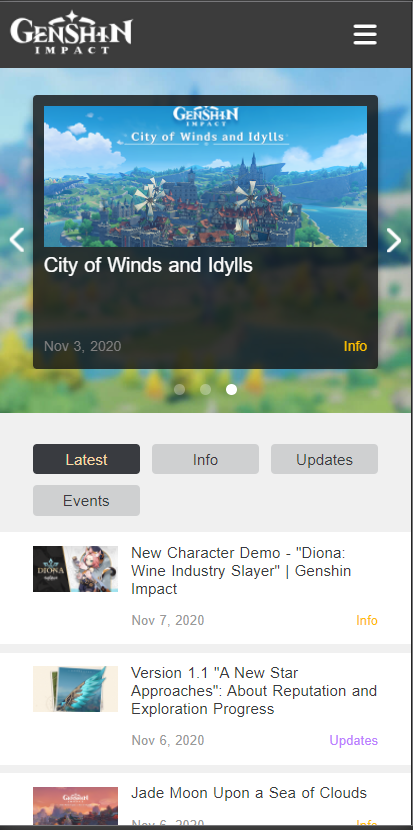
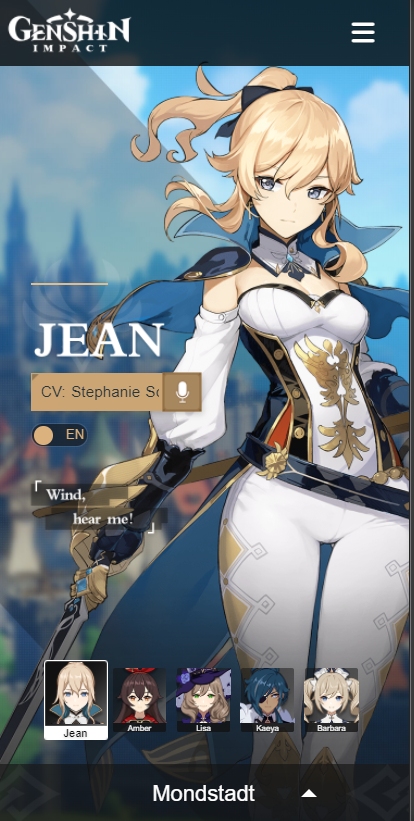

# Procesverslag
**Auteur:** Jeffrey Ullers

Markdown cheat cheet: [Hulp bij het schrijven van Markdown](https://github.com/adam-p/markdown-here/wiki/Markdown-Cheatsheet). Nb. de standaardstructuur en de spartaanse opmaak zijn helemaal prima. Het gaat om de inhoud van je procesverslag. Besteedt de tijd voor pracht en praal aan je website.

## Bronnenlijst
1. https://genshin.mihoyo.com/en
2. https://www.w3schools.com/howto/howto_js_sticky_header.asp
3. -...-

## Eindgesprek (week 7/8)

-dit ging goed & dit was lastig-

**Screenshot(s):**

-screenshot(s) van je eindresultaat-

## Voortgang 3 (week 6)

-same as voortgang 1-

## Voortgang 2 (week 5)

-same as voortgang 1-

## Voortgang 1 (week 3)

### Stand van zaken

-dit ging goed & dit was lastig-

Om heel eerlijk te zijn vond ik het lastig om met mijn nieuwe kennis deze layout te maken. Ik leerde bijvoorbeeld dat positie absoluut zich positioneerd in de relatieve display van de parent en dat probeerde ik toe te passen en dat is aardig gelukt. Ik heb voorheen veel met divs gewerkt en dat mag nu al een tijd niet meer maar het blijft lastig om die te omzeilen.

Javascript vond ik vanaf het begin lastig maar ik ben aardig op weg om het beter te begrijpen en denk dat ik onder de knie heb wat ons tot nu toe is geleerd.

**Screenshot(s):**
Ik ben als ik zelf mag zeggen aardig opweg, ik mis nog enkel een aantal dingen als wat dingen op de home pagina en de footer maar voor derest heb ik de pagina goed in elkaar gezet.

Ik heb hier de content bijna pixel perfect nagebouwd, ik heb geprobeerd het positioneren van de lessen toe te passen.

Hier zie je de iets geavanceerdere button die ik heb na weten te schrijven, in de button zit nog een before waarin de play knop in het midden met css word gestyled.

Hier heb ik geprobeerd de nieuwslijst na te bouwen, de li'tjes waarin a's en p's stonden heb ik goed overgenomen. Echter krijg ik het niet voor elkaar om de 3 punten achter iedere tekst te zetten als die te lang is... daar kom ik nog op terug

Hier zie je dat ik mijn achtergrond via css toevoeg aan de section, deze positioneer ik zo zodat men het meeste van de afbeelding nog kan zien.

De nav heb ik ook 1 op 1 geprobeerd na te bouwen, hij komt geanimeerd naar binnen en gaat ook weer zo weg, het achtergrond word donkerder gemaakt net als op de echte website. Hiervoor heb ik mijn eerste div gebruikt op de website omdat ik er niet uitkwam hoe ik dit anders kon doen...

### Agenda voor meeting

| Daan | Andrej | Jeffrey | Bilal |
| --- | --- | --- | --- |
| Hoe zet je de navigatie vanaf de searchbutton tot winkelmand naar rechts? | De website newgrounds.com lijkt mij toch te lastig voor een blauwe piste. Is dit een correcte observatie of lijkt dat moeilijker dan dat het is? (Surface) | Hoe kan je een slider het beste aanmaken? ( dus afbeelding met 4 klikbare bolletjes erin om van afbeelding te switchen ) | Zijn er nog een aantal makkelijkere opdrachten om te doen voor javascript ,omdat ik javascript iets te moeilijk vindt om te doen? |
| | Hoe zet je een looped video op de achtergrond en kan ik bovenop die videos nog images plaatsen? | | Ik heb een video gekeken voor een hamburger menu, deze video maakt gebruik van jquery. Mag je jquery gebruiken als je snapt wat er gebeurt? |
| | Hoe goed moet je het minimale javascript onderdeel nou snappen om het te gebruiken? | | |
| | Is de website https://osu.ppy.sh/home een geschiktere website als blauwe piste in uw mening? | | |

### Verslag van meeting

-na afloop snel uitkomsten vastleggen-

## Breakdownschets (week 1)

## Intake (week 1)
-uitwerken voor de kick-off werkgroep - begin van de eerste week-

**Je startniveau:** Rode piste

**Je focus:** Responsive

**Je opdracht:** https://genshin.mihoyo.com/en

**Screenshot(s) van de eerste pagina (small screen):**

**Screenshot(s) van de tweede pagina (small screen):**

